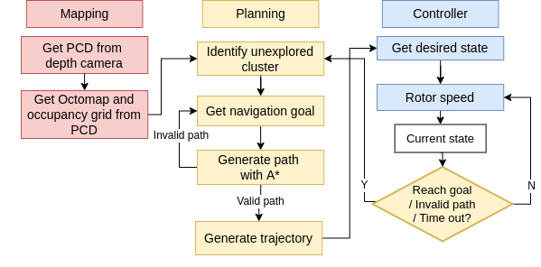

# Group Projects - Advanced Challenge 1 – Simulation & Mapping

**Task: Use a mapping approach of your choice to navigate an unknown environment**

## Overview



Please see the README's located in each of the linked packages under [Setup](#setup) for more details.

## Setup

- [Simulation](catkin_ws/src/simulation) (Unity environment) - Luca

- [Vision](catkin_ws/src/vision_pkg)  - Junpeng

- [Controller](catkin_ws/src/controller_pkg) - Autumn

- [Mapping](catkin_ws/src/mapping) - Shervin, Weihang

- [Navigation](catkin_ws/src/navigation) - Shervin

## Simulation instructions

### Prerequisites

We assume you are running Ubuntu 18.04 and have ROS-melodic installed.

Please follow [this](http://wiki.ros.org/melodic/Installation/Ubuntu) guide for installing ROS-melodic. In short, you need to run these commands:

```
sudo sh -c 'echo "deb http://packages.ros.org/ros/ubuntu $(lsb_release -sc) main" > /etc/apt/sources.list.d/ros-latest.list'
```
```
sudo apt install curl
```
```
curl -s https://raw.githubusercontent.com/ros/rosdistro/master/ros.asc | sudo apt-key add -
```
```
sudo apt update
```
```
sudo apt install ros-melodic-desktop-full
```
```
sudo apt install python-rosdep python-rosinstall python-rosinstall-generator python-wstool build-essential
```

### Installation

Clone the repository:

```
git clone git@gitlab.lrz.de:00000000014ACFEA/autonomous-systems-2021-group-auto.git
```

Open a terminal and navigate to *AdvancedChallenge1SimAndMapping/catkin_ws*.

Run the below commands to fetch data from the submodules this project depends on:

```
git submodule init
```

```
git submodule update
```

Run `catkin build` to build the workspace.

### Simulation

You will need five terminals. In each terminal, navigate to *AdvancedChallenge1SimAndMapping/catkin_ws* and run `source devel/setup.bash`.

In different terminals, run:

- `roscore`

- `roslaunch simulation simulation.launch`

- `roslaunch controller_pkg controller.launch`

- `roslaunch mapping mapping.launch`

- `roslaunch navigation navigation.launch`

### Unity files
The raw unity files of the 200x200 environment can be downloaded from the following link:
- `https://www.dropbox.com/s/e4onw7ebi0lk351/Unity.zip?dl=0`

The pre-compiled 200x200 unity environment can be downloaded using the following link:
- `https://www.dropbox.com/s/r5s11wxvnu4sm13/City_Scenary.zip?dl=0`

The pre-compiled testing environment can be download using the following link:
- `https://www.dropbox.com/s/0q4qdkgupfe19jt/City_Scenary.zip?dl=0`
