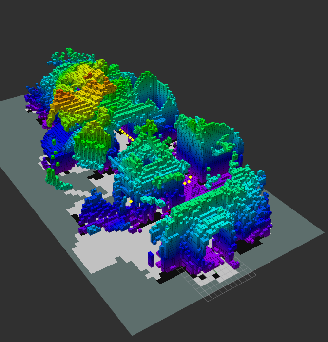

# Mapping

This module is responsible for launching the vision package, as well as the octomap server and RViz.
The vision package is launched since it provides the pointclouds which in turn will be converted into an Octomap, and then into an occupancy grid.

## Octomap

Two nodes of type octomap server are started. The [first one](launch/octomap_2d.launch) is responsible for generating the 2D occupancy grid, which is used for navigation. The [second one](launch/octomap_3d.launch) generates the 3D map. It therefore has a higher resolution (lower value for the parameter), and it includes a broader range of points in the mapping.

The [parameters](https://wiki.ros.org/octomap_server#Parameters) set in the [launch file](launch/octomap_2d.launch) of the 2D server are of great importance. Most notably, we set the minimum and maximum height of pointclouds to be inserted in the map. The values are 4.5 and 5.5 respectively, since we have defined the goal height of the drone to be 5 meters above the ground. By setting these parameters, we avoid the ground being considered as an obstacle.

The resolution is also defined in this launch file. A higher resolution will lead to a more detailed mapping, but it will be more computationally expensive. We also set the max range of the sensor to a resonable value, since it is infinity by default.

## RViz
RViz is essential for visualization. We display the following:

- The body frame of the UAV
- The 3D Octomap
- The 2D occupancy grid
- The waypoints (red is start, blue is goal)

## Example
The below image shows the 3D map generated by the drone after autonomously exploring the environment.

The 2D occupancy grid in the bottom plane signals the following:
- A grey cell is unknown
- A white cell is free
- A black cell is occupied.

The yellow markers are the waypoints the drone should follow.
The grid and the axis displays the center of the world frame.
The body frame of the drone is also displayed in RViz, but it is not visible in the image.

