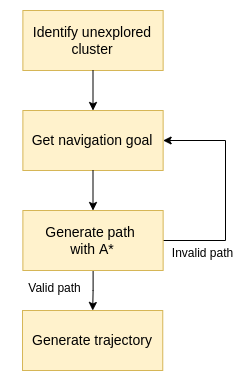

# Navigation

We use the below structure to identify and navigate towards unknown space. The navigation node uses the methods defined by the Navigator class for the implementation. It runs [this](https://gitlab.lrz.de/00000000014ACFEA/autonomous-systems-2021-group-auto/-/blob/main/AdvancedChallenge1SimAndMapping/catkin_ws/src/navigation/src/navigation_node.cc#L19) loop, where it continously checks the termination criteria listed at the bottom of this page.

## Generating waypoints

### Finding a suitable goal
The goal is initially chosen to be the location where there are the most unknowns in the map. 
For this, a helper class called [ClusterCenter](include/ClusterCenter.h) was created. It takes as input a binary matrix and its dimensions.
It finds the largest rectangle of 1's, and returns the center of this rectangle.
The occupancy grid is therefore transformed into a binary matrix, where the value of 1 is assigned if the cell in the occupancy grid is unknown.
The implementation is based on [this](https://stackoverflow.com/a/20039017/14969444) answer on Stack Overflow. 

### Creating a collision-free path

A* is used to generate the shortest path from the current position of the drone to the goal.
[This](https://github.com/daancode/a-star/blob/master/source/AStar.cpp) library is used.

#### Re-iterating
If no valid path is found, a new goal location is selected. This time the first unknown cell in the occupancy grid is chosen. This process is repeated until a collision-free path is found.

## Trajectory generation
Once the waypoints are ready, they are set as positional constraints in the trajectory generation. A minimum snap trajectory is generated with the help of the [mav_trajectory_generation](https://github.com/ethz-asl/mav_trajectory_generation) package from ETH Zurich. The trajectory is then sampled to the controller at a given rate.

## Termination criteria
There are three scenarios which lead to the generation of new waypoints:
- The goal has been reached.
- New information (updated map) shows that the path is invalid.
- The drone has been stationary for too long, which indicates that it is stuck.
